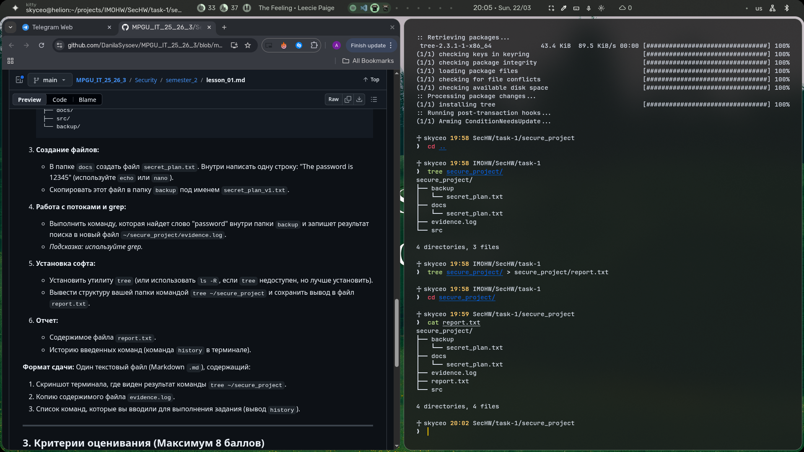

# 1. история команд

```bash
♰ skyceo 19:48 ~
❯  cd projects♰ skyceo 19:49 ~/projects
❯  cd IMOHW/♰ skyceo 19:49 ~/projects/IMOHW
❯  ls
MPGU_IT_25_26_3-main  OOPHW  PyHW  SecHW  WebHW♰ skyceo 19:49 ~/projects/IMOHW
❯  cd SecHW/♰ skyceo 19:49 projects/IMOHW/SecHW
❯  mkdir task-1♰ skyceo 19:49 projects/IMOHW/SecHW
❯  cd task-1/♰ skyceo 19:49 IMOHW/SecHW/task-1
❯  mkdir secure_project♰ skyceo 19:50 IMOHW/SecHW/task-1
❯  cd secure_project/♰ skyceo 19:50 SecHW/task-1/secure_project
❯  mkdir docs src bakup♰ skyceo 19:51 SecHW/task-1/secure_project
❯  ls
bakup  docs  src♰ skyceo 19:51 SecHW/task-1/secure_project
❯  cd docs♰ skyceo 19:51 task-1/secure_project/docs
❯  nano secret_plan.txt♰ skyceo 19:52 task-1/secure_project/docs
❯  cat secret_plan.txt
The password is 12345♰ skyceo 19:52 task-1/secure_project/docs
❯  cd ..♰ skyceo 19:53 SecHW/task-1/secure_project
❯  grep -R "password" backup > evidence.log
grep: backup: No such file or directory
[ble: exit 2]♰ skyceo 19:54 SecHW/task-1/secure_project
❯  mv bakup backup♰ skyceo 19:55 SecHW/task-1/secure_project
❯  grep -R "password" backup > evidence.log
[ble: exit 1]♰ skyceo 19:55 SecHW/task-1/secure_project
❯  cat evidence.log♰ skyceo 19:55 SecHW/task-1/secure_project
❯  cp docs/secret_plan.txt backup/♰ skyceo 19:57 SecHW/task-1/secure_project
❯  grep -R "password" backup > evidence.log♰ skyceo 19:57 SecHW/task-1/secure_project
❯  cat evidence.log
backup/secret_plan.txt:The password is 12345♰ skyceo 19:57 SecHW/task-1/secure_project
❯  yay -Sy tree
[sudo] password for skyceo:
:: Synchronizing package databases...
 core                           122.5 KiB   186 KiB/s 00:01 [################################] 100%
 extra                            8.0 MiB  6.33 MiB/s 00:01 [################################] 100%
Sync Explicit (1): tree-2.3.1-1
:: Synchronizing package databases...
 core is up to date
 extra is up to date
resolving dependencies...
looking for conflicting packages...Packages (1) tree-2.3.1-1Total Download Size:   0.04 MiB
Total Installed Size:  0.09 MiB:: Proceed with installation? [Y/n] Y
:: Retrieving packages...
 tree-2.3.1-1-x86_64             43.4 KiB  89.5 KiB/s 00:00 [################################] 100%
(1/1) checking keys in keyring                              [################################] 100%
(1/1) checking package integrity                            [################################] 100%
(1/1) loading package files                                 [################################] 100%
(1/1) checking for file conflicts                           [################################] 100%
(1/1) checking available disk space                         [################################] 100%
:: Processing package changes...
(1/1) installing tree                                       [################################] 100%
:: Running post-transaction hooks...
(1/1) Arming ConditionNeedsUpdate...♰ skyceo 19:58 SecHW/task-1/secure_project
❯  cd ..♰ skyceo 19:58 IMOHW/SecHW/task-1
❯  tree secure_project/
secure_project/
├── backup
│   └── secret_plan.txt
├── docs
│   └── secret_plan.txt
├── evidence.log
└── src4 directories, 3 files♰ skyceo 19:58 IMOHW/SecHW/task-1
❯  tree secure_project/ > secure_project/report.txt♰ skyceo 19:58 IMOHW/SecHW/task-1
❯  cd secure_project/♰ skyceo 19:59 SecHW/task-1/secure_project
❯  cat report.txt
secure_project/
├── backup
│   └── secret_plan.txt
├── docs
│   └── secret_plan.txt
├── evidence.log
├── report.txt
└── src4 directories, 4 files♰ skyceo 19:59 SecHW/task-1/secure_project
❯
```

# 2. cкрин c tree



# 3. evidence.log

```bash
backup/secret_plan.txt:The password is 12345
```
