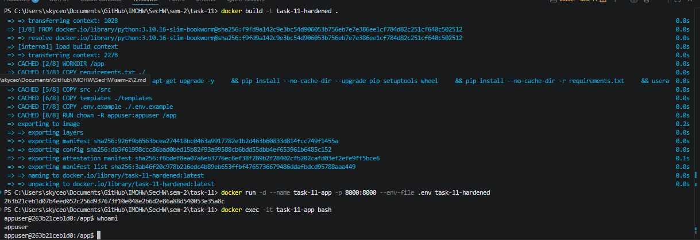
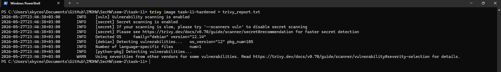
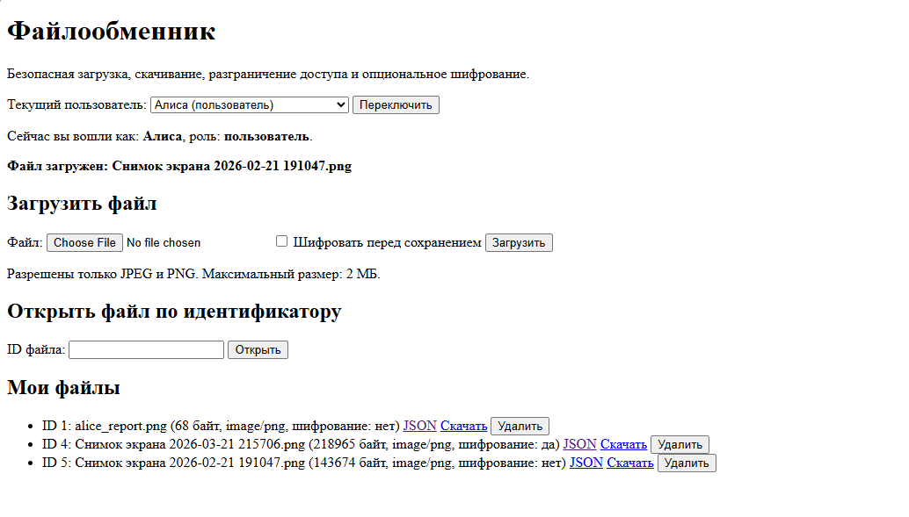

# Расположение

SecHW\sem-2\task-11-15

## Запуск

```bash
docker build -t task-11-13-hardened .
docker run -d --name task-11-13-app -p 8000:8000 --env-file .env task-11-13-hardened
```

### whoami



### trivy



Следовательно его вывод тут: SecHW\sem-2\task-11\trivy_report.txt

### Загрузка файлов

har-лог: SecHW\sem-2\task-11\localhost.har


