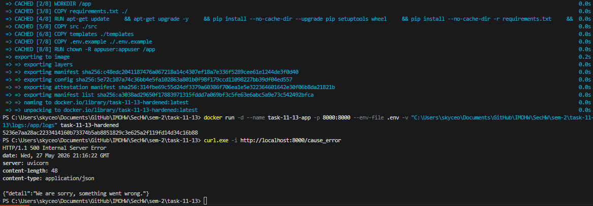
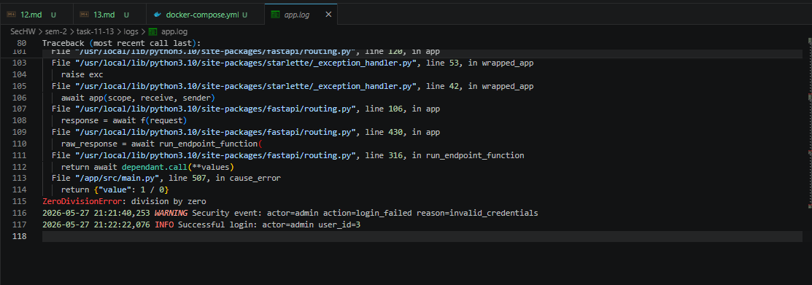
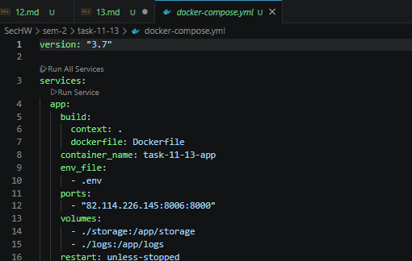

# Запуск

```
docker build -t task-11-13-hardened .
docker run -d --name task-11-13-app -p 8000:8000 --env-file .env -v "C:\Users\skyceo\Documents\GitHub\IMOHW\SecHW\sem-2\task-11-13\logs:/app/logs" task-11-13-hardened
```

# /cause_error

curl.exe -i http://localhost:8000/cause_error



# logs/app.log



# docker-compose.yml


