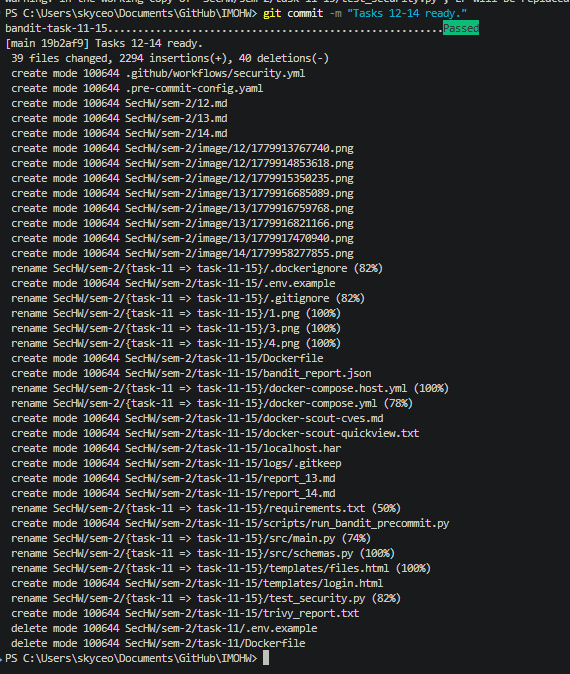
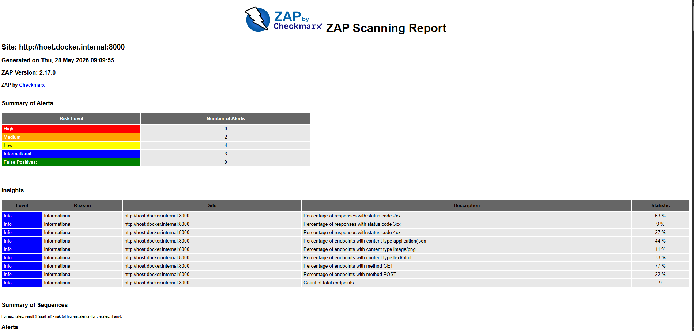

# Bandit

```bash
bandit -r . -f json -o bandit_report.json
```

я не посмотрел на формат сдачи и каждый раз перезаписывал report, пока не убрал уязвимости, их было 3:

main.LOGIN_CREDENTIALS в словаре были пароли, теперь берет из .env (main.build_login_secret_env_name)

жаловался на сравнения CREDENTIALS, для сравнения теперь используется secrets.compare_digest()

import subprocess помечал как место для ручной проверки, поставил просто # nosec B603 (как я понял он просто не проверяет, а говорит, что надо в ручную проверять и поэтому решением было игнорировать)

отчёт: SecHW\sem-2\task-11-15\bandit_report.json

# Workflow комита



.github\workflows\security.yml

# ZAP



SecHW\sem-2\task-11-15\zap_report.html

SecHW\sem-2\task-11-15\zap_report.json

SecHW\sem-2\task-11-15\zap_report.md

SecHW\sem-2\task-11-15\zap_report.txt

SecHW\sem-2\task-11-15\zap.yaml
