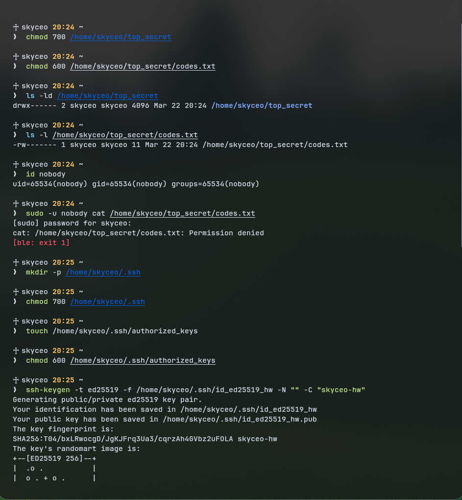

# 1. терминал

я не стал создавать пользователя - (intern)

из того, что пользователя под которым я выполняю команды зовут не root, можно сделать вывод, что я понимаю как его создать.

я понимаю, что можно его после удалить, но все равно не хочу создавать мусор в системе, снимать или нет бал решать вам.

```bash
♰ skyceo 20:23 ~
❯  mkdir -p /home/skyceo/top_secret♰ skyceo 20:23 ~
❯  printf 'secret test' > /home/skyceo/top_secret/codes.txt♰ skyceo 20:24 ~
❯  chmod 700 /home/skyceo/top_secret♰ skyceo 20:24 ~
❯  chmod 600 /home/skyceo/top_secret/codes.txt♰ skyceo 20:24 ~
❯  ls -ld /home/skyceo/top_secret
drwx------ 2 skyceo skyceo 4096 Mar 22 20:24 /home/skyceo/top_secret♰ skyceo 20:24 ~
❯  ls -l /home/skyceo/top_secret/codes.txt
-rw------- 1 skyceo skyceo 11 Mar 22 20:24 /home/skyceo/top_secret/codes.txt♰ skyceo 20:24 ~
❯  id nobody
uid=65534(nobody) gid=65534(nobody) groups=65534(nobody)♰ skyceo 20:24 ~
❯  sudo -u nobody cat /home/skyceo/top_secret/codes.txt
[sudo] password for skyceo:
cat: /home/skyceo/top_secret/codes.txt: Permission denied
[ble: exit 1]♰ skyceo 20:25 ~
❯  mkdir -p /home/skyceo/.ssh♰ skyceo 20:25 ~
❯  chmod 700 /home/skyceo/.ssh♰ skyceo 20:25 ~
❯  touch /home/skyceo/.ssh/authorized_keys♰ skyceo 20:25 ~
❯  chmod 600 /home/skyceo/.ssh/authorized_keys♰ skyceo 20:25 ~
❯  ssh-keygen -t ed25519 -f /home/skyceo/.ssh/id_ed25519_hw -N "" -C "skyceo-hw"
Generating public/private ed25519 key pair.
Your identification has been saved in /home/skyceo/.ssh/id_ed25519_hw
Your public key has been saved in /home/skyceo/.ssh/id_ed25519_hw.pub
The key fingerprint is:
SHA256:T04/bxLRwocgD/JgKJFrq3Ua3/cqrzAh4GVbz2uFOLA skyceo-hw
The key's randomart image is:
+--[ED25519 256]--+
|  .o .           |
|  o . + o .      |
|.  * o + + o o   |
|..= = + o . = o  |
| o.E.o +S.o  +   |
|  +.... o= ..    |
| o =o. o  o o.   |
|. . .o+ .   .o.  |
|      .=oo.  o.  |
+----[SHA256]-----+♰ skyceo 20:26 ~
❯  cat /home/skyceo/.ssh/id_ed25519_hw.pub >> /home/skyceo/.ssh/authorized_keys♰ skyceo 20:26 ~
❯  chmod 600 /home/skyceo/.ssh/id_ed25519_hw♰ skyceo 20:26 ~
❯  ls -la /home/skyceo/.ssh
total 32
drwx------  2 skyceo skyceo 4096 Mar 22 20:26 .
drwx------ 69 skyceo skyceo 4096 Mar 22 20:23 ..
-rw-------  1 skyceo skyceo   91 Mar 22 20:26 authorized_keys
-rw-------  1 skyceo skyceo  399 Mar 22 20:26 id_ed25519_hw
-rw-r--r--  1 skyceo skyceo   91 Mar 22 20:26 id_ed25519_hw.pub
-rw-------  1 skyceo skyceo 2219 Mar 10 18:42 known_hosts
-rw-------  1 skyceo skyceo 1475 Mar 10 18:41 known_hosts.old♰ skyceo 20:26 ~
❯
```


